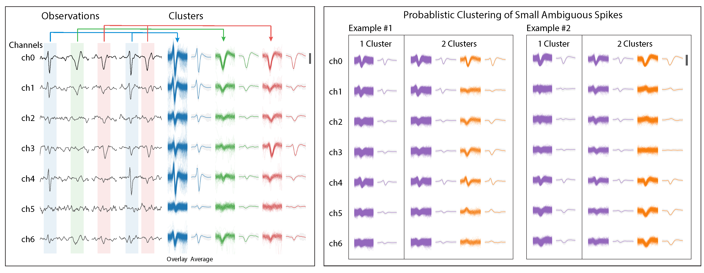
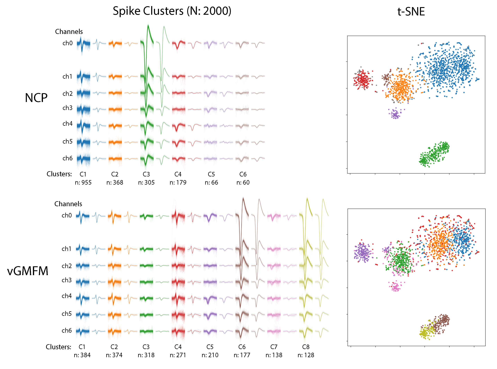

# ncp-sort
Spike sorting using the [Neural Clustering Process (NCP)](https://github.com/aripakman/neural_clustering_process) algorithm. 

Ari Pakman, Yueqi Wang, Catalin Mitelut, JinHyung Lee, Liam Paninski, [Discrete Neural Processes](https://arxiv.org/abs/1901.00409), arXiv:1901.00409


```
# python 3.6
pip install -r requirements.txt

python -m ncpsort.train_ncp  # in the current directory
```

<br/>

<p align="center"> 

</p>

<p align="center"> 
Left: A detection module isolates multi-channel spike waveforms. The isolated waveforms are clustered by NCP. Right: Multiple sample cluster configurations from the NCP posterior, each indicating a visually plausible clustering of the data. 
</p>

<br/>

<p align="center"> 

</p>

<p align="center"> 
2000 spike waveforms from real data are clustered by NCP compared to vGMFM (variational inference on Gaussian Mixture of Finite Mixtures). 
</p>

<br/>


```
@misc{1901.00409,
Author = {Ari Pakman and Yueqi Wang and Catalin Mitelut and JinHyung Lee and Liam Paninski},
Title = {Discrete Neural Processes},
Year = {2019},
Eprint = {arXiv:1901.00409},
}
```
